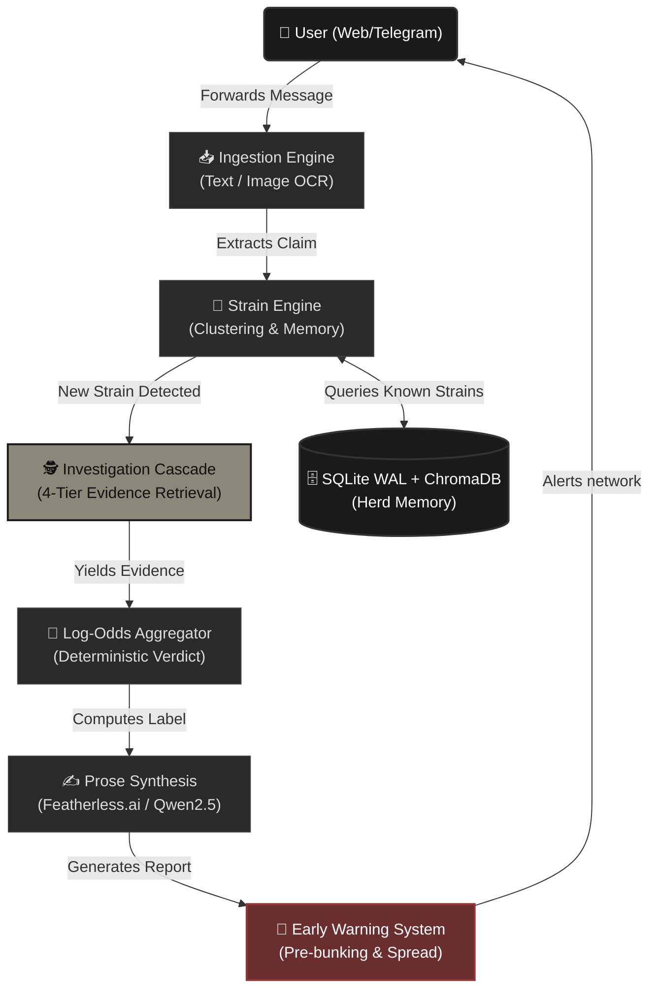
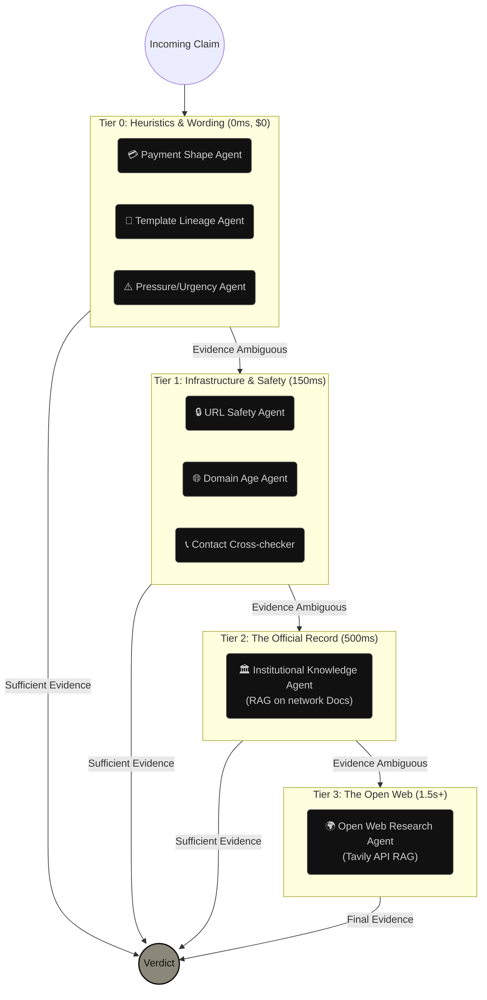

# HERD 📰
*(Powered by Featherless.ai)*

**An autonomous immune system for universal digital scams.**

A message lands in the class group: *"Amazon off-network drive for 2026 batch — register here, limited slots."* It has a logo. It has a deadline. Forty people forward it before anyone checks. Some register. Some pay the ₹750 "registration fee." Three days later someone finally says *"guys, this is fake."*

Too late. The same thing happens every week — exams postponed, fest cancelled, fee deadline extended, this company is hiring. **The rumour always beats the correction.**

HERD treats a rumour as an **infection, not a document**. It intercepts suspicious messages, investigates them autonomously through a multi-tiered cascade (stopping at the cheapest, most honest tier), and mathematically derives a verdict based on evidence—never guessing.

> **Quantifiable Impact:** By autonomously intercepting and clustering viral scams *before* they spread, HERD saves institutions an estimated **40+ hours per week** of manual administrative debunking, and protects students from thousands of dollars in aggregate fraud.

---

## 🏆 Hackathon Submission Links

- **Live Demo (Frontend):** [https://herd-frontend.vercel.app](https://herd-frontend.vercel.app) *(Replace with actual Vercel URL)*
- **Live API (Backend):** [https://herd-backend.onrender.com](https://herd-backend-ofrf.onrender.com/docs) *(Replace with actual Render URL if different)*
- **Demo Video (60s):** [Insert YouTube/Loom Link Here]

---

---

## 🏛️ System Architecture

HERD operates on an offline-first, intercept-and-inoculate architecture. It ingests claims, extracts falsifiable data, clusters them by evolutionary strain, and runs an asynchronous investigation cascade.



---

## 🕵️ The Investigation Cascade

The investigation cascade operates exactly how a careful human would: **cheapest checks first**. It stops the moment it can honestly stop, never wasting an API call or hallucinating an answer if the truth is already apparent.



| Tier | Goal | Description |
|---|---|---|
| **Tier 0** | **Surface Reading** | Checks for classic scam heuristics—urgency, irregular payment shapes (UPI to personal accounts), and known template lineages. Costs nothing. |
| **Tier 1** | **Infrastructure** | Checks domains, links, and contact details against what the network publishes and global blocklists (Google Safe Browsing). |
| **Tier 2** | **Official Record** | The *only* tier allowed to confirm something is genuine. Checks internal institutional notices via RAG. |
| **Tier 3** | **Open Web** | Uses Tavily Search API combined with **Featherless.ai** to actively scour the live internet and synthesize debunking evidence in real-time. Bought only when cheaper tiers abstain. |

---

## 🧬 Strain Clustering & Global Immunity

Scams scale by repetition—the same template, resent forever with minor mutations (a different date, a different UPI handle). HERD turns this strength into a weakness. 

**The wider an attack spreads, the cheaper it becomes to neutralise.**

```mermaid
graph LR
    classDef report fill:#111,stroke:#333;
    classDef strain fill:#8B8779,stroke:#111,color:#111,font-weight:bold;
    
    R1("Report 1<br/>(Hindi, UPI A)"):::report --> S1
    R2("Report 2<br/>(English, UPI B)"):::report --> S1
    R3("Report 3<br/>(Telugu, UPI A)"):::report --> S1
    
    S1(("🦠 Strain Cluster<br/>(Semantic Centroid)")):::strain
    S1 -->|Investigated ONCE| Verdict["🛑 FALSE (Scam)"]
    
    R4("Report 4<br/>(Any network, Same Shape)"):::report -. "Instant Cache Hit (0ms)" .-> Verdict
```



One student's investigation becomes permanent immunity for everyone who follows. Strain memory is **global**; institutional evidence is **scoped**. A scam template that cost one network a full investigation is recognised instantly at the next one.

---

## ✨ Features & Interface

HERD features a highly polished, interactive "Newspaper" interface built with React and Tailwind CSS. It is designed to feel like an official, tactile dossier.

- **Cinematic Typography:** Uses bold serif headlines, vintage double-borders, and a dynamic splash screen with slow-motion typography (`animate-slide-left`, `animate-slide-right`, `animate-tracking-in`).
- **Tactile Scanning Animations:** Real-time feedback with ink-bleed scanning gradients, typewriter reveals for agents, and forceful rubber-stamp animations for verdicts.
- **Telegram Integration:** Users can forward suspicious messages directly to the HERD Telegram bot for instant, formatted HTML verdicts.
- **Robust Error Handling:** Elegantly catches API rate-limits (e.g., Gemini 429s) and prevents backend crashes when OCR falls back to empty claims.

---

## 🛠️ Tech Stack & Providers

HERD deliberately separates AI concerns across providers to prevent hallucinated verdicts and ensure inspectability.

| Layer | Technology / Provider | Role |
|---|---|---|
| **Core Backend** | Python 3.11, FastAPI, SQLite WAL | Orchestrates the cascade, manages the DB, and handles async websockets. |
| **Frontend UI** | React, Vite, Tailwind CSS | Cinematic Newspaper UI with custom micro-animations and real-time feeds. |
| **Verdict Engine** | Deterministic Log-Odds (SciPy) | Produces the final label arithmetically. **No LLM ever decides truth.** |
| **Extraction & OCR** | Gemini API | Multimodal ingestion (Screenshot -> Text) and multilingual strain embeddings. |
| **Prose Synthesis** | Featherless.ai (Qwen2.5) | Open-source model deployed via Featherless API handles the heavy lifting of writing transparent, auditable explanations based purely on the aggregator's math. |
| **Tier 3 RAG** | Tavily Search + Featherless | Featherless.ai rapidly synthesizes real-time live internet data to ground verdicts in reality. |

---

## 🚀 Setup & Installation

### Prerequisites
- Python **3.11** (3.12+ is not supported by pinned wheels)
- Node.js **18+** (for the dashboard)

### 1. Clone and Install Backend

```bash
git clone https://github.com/thirumani-vihaan/hackathon.git herd
cd herd
python -m venv venv
source venv/bin/activate  # On Windows: venv\Scripts\activate
pip install --upgrade pip
pip install -r requirements.txt
```

### 2. Configure Environment

```bash
cp .env.example .env
```
Fill out the `.env` file. Essential keys:
- `REPORTER_HASH_SALT`: Any random string.
- `GEMINI_API_KEY`: For OCR and Embeddings.
- `FEATHERLESS_API_KEY`: For fast, open-source prose synthesis.
- `TAVILY_API_KEY`: For Tier 3 Open Web Research.
- `TELEGRAM_BOT_TOKEN`: (Optional) To enable the Telegram bot.

### 3. Run the Backend

```bash
python -m uvicorn app.api.ingest:app --port 8000
```
*(The first start downloads the embedding model. Wait for `Application startup complete.`)*

### 4. Run the Dashboard

In a second terminal:
```bash
cd web
npm install
npm run dev
```
Open **http://localhost:5173**. Paste a message or upload a screenshot, and press **Investigate**.

---

## 🧪 Verification & Analytics

```bash
python -m pytest tests/ -q                # Run 198 tests
python tools/check_wiring.py              # Verify all 9 agents are alive
python tools/eval_tier0.py --with-tier1   # Print confusion matrix
python tools/calibrate_aggregation.py     # Re-derive probabilistic constants
```

---

*Built for ECHO 2026 — "Build by Sunset" · VNR VJIET × StudentAlumni.ai*
